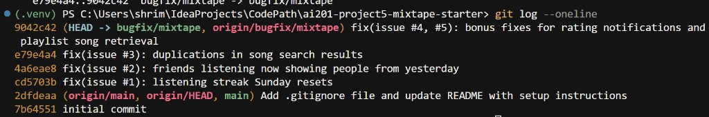

# Mixtape Bug Hunt — Submission

## AI Usage

I used AI throughout this project. Below is an honest account of what it helped with, what I verified myself, and where its guidance was incomplete.

### What I asked AI to do

- **Codebase orientation:** Summarize `models.py`, each file in `routes/` and `services/`, and trace data flows (e.g. `POST /songs/<id>/rate` → `notification_service.rate_song()`). This produced the codebase map below.
- **Environment setup:** Debug why `FLASK_APP=app:create_app flask run` failed on Windows PowerShell. AI identified the bash-vs-PowerShell syntax issue (`$env:FLASK_APP = "app:create_app"`).
- **Bug reproduction:** For each issue, AI helped write targeted reproduction scripts and interpret pytest output — especially for time-sensitive bugs (#1 Sunday streak, #2 morning-after feed) where controlled `datetime` patching was needed.
- **Root cause analysis:** AI traced call chains and compared working vs broken code paths. Issue #4 was found by line-by-line comparison of `rate_song()` vs `add_to_playlist()` in the same file. Issue #5 was found by spotting `songs[:-1]` in the return statement.
- **Documentation:** AI drafted and refactored the RCA entries in this file to match the required five-field format.

### What AI helped me understand

- The app follows a strict **routes → services → models** pattern; bugs live in `services/`, not routes.
- `PlaylistSong` / `playlist_entries` uses a `position` column for ordering — relevant when reasoning about Issue #5.
- Issue #1 was a `weekday() != 6` guard that blocked Sunday from the streak increment branch.
- Issue #2 was a filter-type mismatch (rolling 24-hour window vs calendar-day boundary), not primarily a timezone bug — though UTC-only timestamps can still feel wrong to local-time users.
- Issue #3 duplicates were proportional to tag count because `outerjoin(song_tags)` multiplied SQL rows, even though tags load separately via `Song.tags`.
- Issue #4 was an architectural omission — `rate_song` saved the rating but never called `create_notification()`, unlike the working `add_to_playlist` pattern.

### Where I verified myself or AI was incomplete

- **Issue #3 — ORM masking the bug:** AI initially flagged the `outerjoin` as the cause, but a live `search_songs("Anthem")` call returned only 1 result on SQLAlchemy 2.0. I verified with raw SQL (`3 rows`) and `scalars().all()` without `.unique()` (`3 duplicates`) before confirming the join was wrong regardless of ORM deduplication.
- **Issue #4 — first repro script failed:** AI's initial reproduction used `add_to_playlist()` via `playlist.songs.append()`, which hit a `NOT NULL` error on `playlist_entries.position`. I simplified to a `rate_song`-only repro, which clearly showed `notification_count=0`.
- **Issue #2 — timezone nuance:** AI's first instinct included local-timezone misalignment as a co-cause. After running a US Pacific vs UTC comparison script, I confirmed the rolling 24-hour cutoff was the primary driver and documented timezone as a secondary UX factor only.
- **All fixes:** AI proposed each fix, but I ran `pytest tests/ -v` after every change (15/15 passing) and manually checked that tags still loaded in search results and self-ratings did not trigger notifications.

---

### Overview

Mixtape is a Flask + SQLAlchemy social music app. It follows a **routes → services → models** pattern: routes handle HTTP parsing and JSON responses; all business logic lives in `services/`; `models.py` defines the database schema.

### Main Files


| File                               | Role                                                                                                                                                            |
| ---------------------------------- | --------------------------------------------------------------------------------------------------------------------------------------------------------------- |
| `app.py`                           | Flask app factory (`create_app`). Initializes SQLAlchemy, registers four blueprints (`/songs`, `/playlists`, `/users`, `/feed`), and creates tables on startup. |
| `models.py`                        | Defines 7 SQLAlchemy models plus 3 association tables.                                                                                                          |
| `routes/songs.py`                  | Song search, detail, rating (`POST /songs/<id>/rate`), and listening events (`POST /songs/<id>/listen`).                                                        |
| `routes/playlists.py`              | Playlist CRUD and adding songs to playlists.                                                                                                                    |
| `routes/users.py`                  | User profiles, streak lookup, and notification retrieval.                                                                                                       |
| `routes/feed.py`                   | "Friends Listening Now" and general activity feed.                                                                                                              |
| `services/streak_service.py`       | Records listening events and updates consecutive-day streaks.                                                                                                   |
| `services/feed_service.py`         | Builds friend activity feeds from `ListeningEvent` records.                                                                                                     |
| `services/search_service.py`       | Case-insensitive song search by title or artist.                                                                                                                |
| `services/notification_service.py` | Creates notifications for social interactions; also handles rating and playlist-add side effects.                                                               |
| `services/playlist_service.py`     | Playlist creation and ordered song retrieval.                                                                                                                   |
| `seed_data.py`                     | Seeds 5 users, 25 songs, 3 playlists, listening events, and friendships for local testing.                                                                      |


### Data Model (`models.py`)

Seven models and three join tables:

- **User** — username, email, `listening_streak`, `last_listened_at`. Many-to-many friendships via `friendships` table.
- **Song** — title, artist, album, genre, `shared_by` (FK to User). Many-to-many tags via `song_tags`.
- **Tag** — genre/category labels attached to songs.
- **ListeningEvent** — records when a user listened to a song (`user_id`, `song_id`, `listened_at`). Drives streaks and feeds.
- **Rating** — one rating per user per song (1–5), enforced by a unique constraint.
- **Playlist** — name, creator, collaborative flag. Songs linked via `playlist_entries` join table, which includes a `position` column for ordering.
- **Notification** — `notification_type`, `body`, `read` flag, sent to a `user_id`.

### Organizational Patterns

1. **Thin routes, fat services** — Routes validate request params, call one service function, and return JSON. They never touch the database directly (except `routes/users.py` for a simple user lookup).
2. **Side effects bundled in services** — `notification_service.rate_song()` saves the rating; `notification_service.add_to_playlist()` both adds the song and creates a notification. This is the pattern to compare when debugging Issue #4.
3. **Errors via `ValueError`** — Services raise `ValueError` for missing entities or bad input; routes catch these and return 400/404.
4. `**to_dict()` on models** — Every model has a `to_dict()` method for JSON serialization. Services return dicts (or model instances that routes call `.to_dict()` on).

### Data Flow: Rating a Song (Issue #4 territory)

```
POST /songs/<song_id>/rate
  → routes/songs.py :: rate()
    → parses JSON body: { user_id, score }
    → services/notification_service.py :: rate_song(user_id, song_id, score)
      → validates score (1–5), fetches Song and User
      → upserts a Rating record (update if exists, create if new)
      → db.session.commit()
      → returns Rating instance
    → route returns rating.to_dict() as JSON 201
```

For comparison, the **working** playlist-add notification flow:

```
POST /playlists/<playlist_id>/songs
  → routes/playlists.py :: add_song()
    → services/notification_service.py :: add_to_playlist(playlist_id, song_id, added_by)
      → validates song, user, playlist exist
      → appends song to playlist.songs if not already present
      → if added_by ≠ song.shared_by:
          → create_notification(user_id=song.shared_by, type="song_added_to_playlist", body=...)
      → returns None (route returns 201 message)
```

The key difference: `add_to_playlist` calls `create_notification()` after the main action, but `rate_song` does not.

### Data Flow: Recording a Listen (Issue #1 territory)

```
POST /songs/<song_id>/listen
  → routes/songs.py :: listen()
    → services/streak_service.py :: record_listening_event(user_id, song_id)
      → creates ListeningEvent with current UTC timestamp
      → calls update_listening_streak(user, now)
        → compares today's date to last_listened_at date
        → increments streak if yesterday, resets if gap > 1 day, no-op if same day
      → commits and returns event
```

Streak is read separately via `GET /users/<user_id>/streak` → `streak_service.get_streak()`.

### Data Flow: Friends Listening Now (Issue #2 territory)

```
GET /feed/<user_id>/listening-now
  → routes/feed.py :: listening_now()
    → services/feed_service.py :: get_friends_listening_now(user_id)
      → loads user's friends
      → queries ListeningEvents from friends where listened_at >= (now - 24 hours)
      → deduplicates to one entry per friend (most recent)
      → returns list of { friend, song, listened_at } dicts
```

---

## Bug Fix Plan

I've read all five issue descriptions. I plan to fix these three in issue order:


| Priority | Issue                                                      | Why                                                                                                                    |
| -------- | ---------------------------------------------------------- | ---------------------------------------------------------------------------------------------------------------------- |
| 1        | **#1 — Listening streak resets on Sundays**                | Date/time logic bug in `streak_service.py`; good starting point since the listen → streak data flow is already mapped. |
| 2        | **#2 — Friends Listening Now shows people from yesterday** | Feed uses a rolling 24-hour window instead of filtering to today's activity; fix in `feed_service.py`.                 |
| 3        | **#3 — The same song keeps showing up twice in search**    | Search duplicates are conditional on tag count; requires tracing the join logic in `search_service.py`.                |


Stretch goals: **#4** (missing rating notification) and **#5** (last playlist song never shows up) — completed as bonus fixes below.

---

## Root Cause Analysis

Each entry below follows the required five-field format: **(1)** issue number and title, **(2)** how you reproduced it, **(3)** how you found the root cause, **(4)** the root cause, **(5)** your fix and side-effect check.

### Issue #1

#### 1. Issue number and title

**Issue #1 — Listening streak resets on Sundays**  
**Affected service:** `services/streak_service.py` · **Reported by:** kenji

#### 2. How you reproduced it

Set a user to `listening_streak = 12` with `last_listened_at` on Saturday (`2024-06-15 20:00 UTC`), then called `update_listening_streak` with a Sunday timestamp (`2024-06-16 09:00 UTC`). Also ran `pytest tests/test_streaks.py::test_streak_increments_on_sunday`, which failed before the fix.


|                   | Value                     |
| ----------------- | ------------------------- |
| `days_since_last` | 1 (listened yesterday)    |
| `today.weekday()` | 6 (Sunday)                |
| **Expected**      | Streak increments 12 → 13 |
| **Actual**        | Streak resets to 1        |


```
BEFORE Sunday listen: streak=12, last_listened=2024-06-15
AFTER Sunday listen:  streak=1 (expected 13)
```

This is **Sunday-only** — the bug does not fire on other weekdays or when a day was skipped.

#### 3. How you found the root cause

Traced the call chain from the issue report: `POST /songs/<id>/listen` → `routes/songs.py` → `streak_service.record_listening_event()` → `update_listening_streak()`. Opened `services/streak_service.py` and read the streak-update conditional on line 73. Noticed the increment branch required **both** `days_since_last == 1` **and** `today.weekday() != 6` — the second check only passes when today is not Sunday.

#### 4. The root cause

Python's `datetime.weekday()` returns `6` for Sunday. The increment branch on line 73 required `days_since_last == 1 and today.weekday() != 6`, meaning consecutive-day streak updates were explicitly blocked on Sundays. When a user listened on Saturday and again on Sunday, `days_since_last` was correctly `1`, but the `weekday() != 6` check evaluated to `False`, so control fell through to the `else` on line 76 which reset `listening_streak` to `1`. The code treated a valid consecutive-day Sunday listen as a broken streak.

#### 5. Your fix and side-effect check

Removed the erroneous `today.weekday() != 6` guard so consecutive-day logic applies on all days:

```python
# Before
elif days_since_last == 1 and today.weekday() != 6:

# After
elif days_since_last == 1:
```

**Side-effect check:** Ran `pytest tests/test_streaks.py -v` — all 5 tests pass, including consecutive-day increment, same-day no double-count, skipped-day reset, and Sunday increment. No other files changed.

---

### Issue #2

#### 1. Issue number and title

**Issue #2 — Friends Listening Now shows people from yesterday**  
**Affected service:** `services/feed_service.py` · **Reported by:** nova

#### 2. How you reproduced it

Created nova (viewer) and darius (friend) with a `ListeningEvent` at Sunday 11:00 PM UTC, then called `get_friends_listening_now` with `datetime.now()` patched to Monday 9:00 AM UTC — only 10 hours later, but a different calendar day.


|                      | Value                                    |
| -------------------- | ---------------------------------------- |
| Friend `listened_at` | 2024-06-16 23:00 UTC (yesterday)         |
| Viewer checks at     | 2024-06-17 09:00 UTC (today)             |
| **Expected**         | Feed empty — friend did not listen today |
| **Actual**           | Feed contains darius                     |


```
within_24h_window=True
same_calendar_day=False
feed_count=1 (expected 0)
```

#### 3. How you found the root cause

Traced `GET /feed/<user_id>/listening-now` → `routes/feed.py` → `feed_service.get_friends_listening_now()`. On line 32, saw `cutoff = datetime.now(timezone.utc) - RECENT_THRESHOLD` using a rolling 24-hour window. Compared this to `streak_service.py`, which uses calendar-day boundaries via `now.date()`. The reproduction showed the friend's event passed the 24-hour cutoff (`within_24h_window=True`) but failed the calendar-day test (`same_calendar_day=False`).

#### 4. The root cause

`get_friends_listening_now` filtered events with `listened_at >= (now - timedelta(hours=24))`, a rolling 24-hour window. A friend who listened at 11 PM yesterday is still within that window at 9 AM today (10 hours elapsed), so the event passed the filter even though it occurred on a **previous calendar day**. The feed was meant to show friends who listened **today**, but the code measured elapsed hours instead of calendar-day membership — the wrong comparison type entirely.

#### 5. Your fix and side-effect check

Replaced the rolling cutoff with a UTC calendar-day window, consistent with `streak_service.py`:

```python
# Before
cutoff = datetime.now(timezone.utc) - RECENT_THRESHOLD
ListeningEvent.listened_at >= cutoff

# After
start_of_today = datetime(now.year, now.month, now.day, tzinfo=timezone.utc)
start_of_tomorrow = start_of_today + timedelta(days=1)
ListeningEvent.listened_at >= start_of_today,
ListeningEvent.listened_at < start_of_tomorrow,
```

Removed the unused `RECENT_THRESHOLD` constant. Added `tests/test_feed.py` with morning-after and same-day cases.

**Side-effect check:** `pytest tests/test_feed.py tests/test_streaks.py tests/test_search.py -v` — 12 passed. `get_activity_feed()` was not modified (it intentionally returns all recent events regardless of day).

---

### Issue #3

#### 1. Issue number and title

**Issue #3 — The same song keeps showing up twice in search**  
**Affected service:** `services/search_service.py` · **Reported by:** simone

#### 2. How you reproduced it

Searched for `"Anthem"` against `"Crown Heights Anthem"` (3 tags: `rap`, `hip-hop`, `boom bap`) and compared join row counts across songs with 0, 1, and 3 tags. Also ran `pytest tests/test_search.py::test_search_no_duplicates_multi_tag_song`.


| Song                 | Tags | SQL rows returned |
| -------------------- | ---- | ----------------- |
| Plain Song           | 0    | 1                 |
| One Tag Song         | 1    | 1                 |
| Crown Heights Anthem | 3    | **3**             |


```
buggy_titles ['Crown Heights Anthem', 'Crown Heights Anthem', 'Crown Heights Anthem']
```

Duplicates are **conditional on tag count** — simone's report of "once, twice, or three times" maps to how many tags the matching song has.

#### 3. How you found the root cause

Traced `GET /songs/search?q=Anthem` → `routes/songs.py` → `search_service.search_songs()`. On line 27, noticed an `outerjoin(song_tags, ...)` on the `song_tags` association table. Inspected `Song.to_dict()` in `models.py` and saw tags load via the `Song.tags` relationship (`lazy="subquery"`) — the join was never used. Ran SQL-level inspection: `query.count()` returned 3 for a 3-tag song, confirming one row per tag association.

#### 4. The root cause

`search_songs` included `.outerjoin(song_tags, Song.id == song_tags.c.song_id)` even though tags are loaded separately by `song.to_dict()` → `Song.tags`. SQL joins multiply rows — a song with 3 tag associations produces 3 result rows for the same `song.id`. When those rows are converted via `[song.to_dict() for song in results]`, the same song appears 3 times. Songs with 0 or 1 tag were unaffected because the join produced only 1 row.

#### 5. Your fix and side-effect check

Removed the unnecessary `outerjoin` and unused `Tag` / `song_tags` imports:

```python
# Before
db.session.query(Song).outerjoin(song_tags, ...).filter(...).all()

# After
db.session.query(Song).filter(...).all()
```

**Side-effect check:** `pytest tests/test_search.py -v` — all 5 tests pass. `"Crown Heights Anthem"` now returns 1 result with tags `['rap', 'hip-hop', 'boom bap']` still present via `to_dict()`. `get_song()` unchanged.

---

## Bonus Fixes

### Issue #4

#### 1. Issue number and title

**Issue #4 — I got notified when a friend added my song to a playlist but not when they rated it**  
**Affected service:** `services/notification_service.py` · **Reported by:** aaliya

#### 2. How you reproduced it

Created aaliya (song sharer) and kenji (friend), shared a song owned by aaliya, then had kenji rate it via `rate_song(kenji_id, song_id, 4)`. Checked aaliya's notifications with `get_notifications(aaliya_id)`.


| Step                                   | Result                      |
| -------------------------------------- | --------------------------- |
| Friend rates shared song               | Rating saved (`score=4`)    |
| `GET /users/<aaliya_id>/notifications` | 0 notifications             |
| **Expected**                           | 1 `song_rated` notification |
| **Actual**                             | No notification created     |


```
rating_saved=True
notification_count=0
notification_types=[]
expected_notification_count=1
```

For comparison, `add_to_playlist()` in the same file **does** call `create_notification()` when a friend adds someone else's song — seed data includes working `song_added_to_playlist` notifications demonstrating the correct pattern.

#### 3. How you found the root cause

Traced `POST /songs/<song_id>/rate` → `routes/songs.py` → `notification_service.rate_song()`. Compared line-by-line with `add_to_playlist()` in the same file: both validate the song and user, both commit their primary action, but only `add_to_playlist` calls `create_notification()` afterward (lines 65–70). `rate_song` commits the `Rating` and returns — no notification step exists.

#### 4. The root cause

`rate_song` was architecturally incomplete — it handled rating persistence but never triggered the notification side effect. The working `add_to_playlist` function established the pattern: after the main action, if the acting user is not the song's original sharer (`song.shared_by != actor_id`), call `create_notification()` for the sharer. `rate_song` followed the first half of this pattern (save data, commit) but omitted the notification call entirely. The rating saved correctly, but the sharer was never notified.

#### 5. Your fix and side-effect check

Added a `create_notification()` call to `rate_song`, mirroring `add_to_playlist`:

```python
if song.shared_by != user_id:
    create_notification(
        user_id=song.shared_by,
        notification_type="song_rated",
        body=f"{rater.username} rated your song '{song.title}' {score}/5.",
    )
```

**Side-effect check:** Re-ran reproduction — `notification_count=1`, `notification_types=['song_rated']`. Rating still saves correctly. Self-ratings (`song.shared_by == user_id`) do not trigger a notification, matching the `add_to_playlist` guard pattern. Full suite: `pytest tests/ -v` — 15 passed.

---

### Issue #5

#### 1. Issue number and title

**Issue #5 — The last song in a playlist never shows up**  
**Affected service:** `services/playlist_service.py` · **Reported by:** darius

#### 2. How you reproduced it

Created a playlist with 5 songs (positions 1–5) and called `get_playlist_songs(playlist_id)`. Also ran `pytest tests/test_playlists.py` — both song-count and ordering tests failed.


|              | Value                                |
| ------------ | ------------------------------------ |
| Songs in DB  | 5 (`Track 1` through `Track 5`)      |
| **Expected** | 5 songs returned                     |
| **Actual**   | 4 songs returned — `Track 5` missing |


```
titles returned: ['Track 1', 'Track 2', 'Track 3', 'Track 4']
missing: 'Track 5' (highest position / most recently added)
```

Adding a 6th song would make `Track 5` appear and hide `Track 6` — the last entry is always dropped.

#### 3. How you found the root cause

Traced `GET /playlists/<playlist_id>/songs` → `routes/playlists.py` → `playlist_service.get_playlist_songs()`. The query on lines 58–64 correctly fetched all songs ordered by `position`. The bug was on line 66: the return statement sliced the result with `songs[:-1]`, which excludes the final element of every list.

#### 4. The root cause

`get_playlist_songs` used `return [song.to_dict() for song in songs[:-1]]`. Python's `[:-1]` slice returns all elements except the last, so the song at the highest `position` value was always discarded before serialization. Because new songs receive the next sequential position, the most recently added song was consistently the one excluded — producing darius's "always missing the newest song" behavior.

#### 5. Your fix and side-effect check

Removed the erroneous slice:

```python
# Before
return [song.to_dict() for song in songs[:-1]]

# After
return [song.to_dict() for song in songs]
```

**Side-effect check:** `pytest tests/test_playlists.py -v` — all 3 tests pass (all songs returned, correct order, empty playlist still returns `[]`). Full suite: `pytest tests/ -v` — 15 passed. `create_playlist()` and `get_playlist()` unchanged.

---

## Git Log

Screenshot of `git log --oneline` on the `bugfix/mixtape` branch, showing separate commits for each bug fix:



```
9042c42 fix(issue #4, #5): bonus fixes for rating notifications and playlist song retrieval
e79e4a4 fix(issue #3): duplications in song search results
4a6eae8 fix(issue #2): friends listening now showing people from yesterday
cd5703b fix(issue #1): listening streak Sunday resets
```